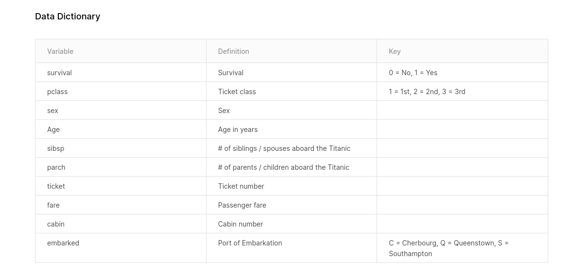

# TITANIC, UNA MIRADA A TRAVÉS DE LOS DATOS


```
El objetivo de este análisis es obtener datos y predicciones a futuro mediante los datos del Titanic.
Debido a la información faltante, se han dividido por grupos y aplicado la media para cada categoría.
Se ha usado Python y Jupiter Notebook para el análisis. 

No te olvides de instalar :Pandas, Numpy, Matplotlib, Seaborn, Sklearn, IPython  
```

···
AQUí VA EN EL FUTURO UN ÁRBOL DE ARCHIVOS
···


## Diccionario de términos : 
<p align="left">
  
</p>

# Puedes visitar el informe aqui: 
Titanic: Una mirada a los datos](http://titanic.demstalfer.com/)
Modelos predictivos](https://github.com/demstalferez/titanic/blob/master/titanicdata/analisis.ipynb)


https://github.com/demstalferez/titanic/blob/master/titanicdata/analisis.ipynb


## Para el Dashboard explicativo se ha usado: 

```
Bootstrap, HTML, CSS, JS
```

## MEJORAS APLICADAS PRÓXIMAMENTE: 

```
*CREACIÓN DE NUEVO DATAFRAME MAESTRO, CON INFO ACTUALIZADA SOBRE LOS BOTES SALVAVIDAS Y LA TRIPULACIÓN.

*CATEGORÍA FAMILIA AGRUPANDO PADRES Y MADRES CASADOS VS LA REFERENCIA ENTRE LOS NIÑOS A BORDO, SE TENDRÁ EN CUENTA LA EDAD DEL NIÑO Y DE LOS PADRES.

*TRIPULACIÓN Y SUS ESTADÍSTICAS, VER COMO SE COMPORTAN.

*LA RELACIÓN DE SUPERVIVENCIA ENTRE LA DISPOSICIÓN DE LOS BOTES.

*INCLUIR A FUTURO DATOS DEL ACCIDENTE, VELOCIDAD, TRAYECTORIA ECT

*MEJORAR LA USABILIDAD DEL DASHBOARD EN MOBILE
```

## Contributing
Eres libre de copiar, modificar, usar y hacer lo que quieras espero pueda serte útil :blush:

## License
[MIT](https://choosealicense.com/licenses/mit/)
